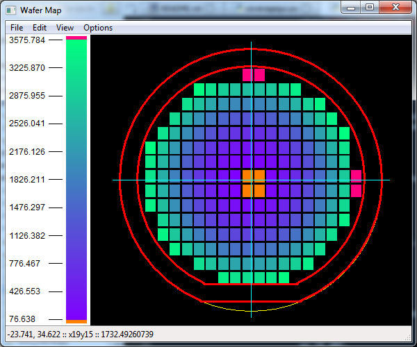
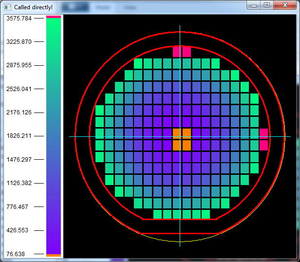
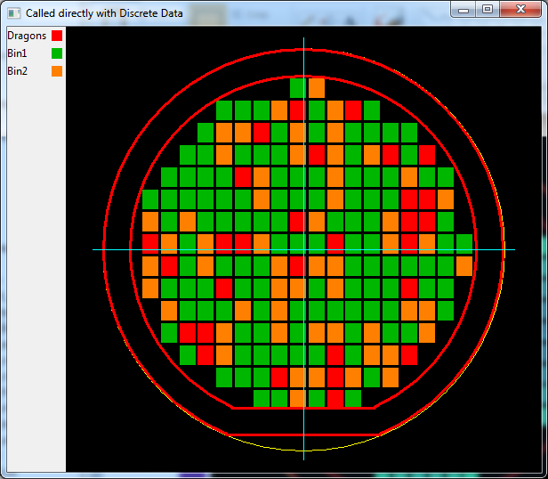

# wafer_map

Plots up a wafer map. Used in semiconductor processing and analysis.

---------------------------------------------------------------------------

## Important Note!
wxPython Phoenix is still in development. This program is tested against
`wxPython_Phoenix-3.0.3.dev1956+aab2833` (2016-03-04 02:08) with the following
two changes.

1.  **Add a hash attribute to wx.Colour.**
    [(more info)](https://groups.google.com/forum/#!topic/wxpython-dev/NLd4CZv9rII)

    In `wx/core.py`, add the following lines at line 558:
    ```python
    def _Colour___hash__(self):
        return hash(tuple(self.Get()))
    Colour.__hash__ = _Colour___hash__
    del _Colour___hash__
    ```

    With context lines, it should look like:

    ```python
    Colour.__setitem__ = _Colour___setitem__
    del _Colour___setitem__
    def _Colour___hash__(self):                 # <-- add this line
        return hash(tuple(self.Get()))          # <-- add this line
    Colour.__hash__ = _Colour___hash__          # <-- add this line
    del _Colour___hash__                        # <-- add this line
    Colour.__safe_for_unpickling__ = True

    # These stock colours will be initialized when the wx.App object is created.
    ```

2.  **Fix a regression in wxPython_Phoenix.**
    [(wxWidgets/Phoenix #55)](https://github.com/wxWidgets/Phoenix/pull/55)

    In `wx/lib/floatcanvas/FCObjects.py`, add the following to line 2727:

    ```python
    self.CalcBoundingBox()
    ```

    With context lines, it should look like:

    ```python
    # this one uses a proprty for _Canvas...
    self._Actual_Canvas = None

    self.CalcBoundingBox()         # <-- add this line
    for obj in ObjectList:
        self.AddObject(obj)
    self.CalcBoundingBox()
    ```

---------------------------------------------------------------------------

## Contents

+ [Features](#features)
+ [Installation](#installation)
+ [Requirements](#requirements)
+ [What's it Look Like?](#whats-it-look-like)
+ [Usage](#usage)
  + [Example](#example)
  + [Nomenclature](#nomenclature)
  + [Keyboard Shortcuts and Mouse Usage](#keyboard-shortcuts-and-mouse-usage)
+ [Notes](#notes)
  + [Current capabilities](#current-capabilities)
+ [Changelog](#changelog)

## Features

- Mouse and keyboard shortcuts!
- Knows SEMI M1-0302 wafer sizes!
- You can change the colors!
- Zoom in and out!
- Use it in your own wxPython apps!
- View the die grid coords, absolute coords, and die value! (but only
  if you use the standalone app or if your app has a status bar).
- Center your map on the wafer however you want!


## Installation

Install from PyPI.

`pip install wafer_map`

## Requirements

wafer_map requires the following non-built-in packages:

- wxPython Phoenix (https://github.com/wxWidgets/Phoenix)
  + If installing on 64-bit Linux for Python 2.7 or 3.4, you can use the
    wheels found [here](https://gitlab.com/dougthor42/wxPython_Phoenix-wheels/tree/master/ubuntu-12.04.5-desktop-amd64).
    Those already have the two requried changes made.
    Alternatively, you can buid from source and make the above changes
    yourself.
  + If installing on Windows or Mac, use the wheels found at the [Phoenix
    snapshot builds](http://wxpython.org/Phoenix/snapshot-builds/) and
    make the two changes listed above.
- numpy (https://pypi.python.org/pypi/numpy)
- colour (https://pypi.python.org/pypi/colour)

and the following core (built-in) packages:

- math
- colorsys


## What's it Look Like?

I know that I wouldn't want to use this if I didn't like how it looked, so
here ya go. Take a look and decide for yourself if you like it.

**Continuous Data being plotted as a stand-alone app:**



**Continuous Data as its own panel:**



**Discrete Data as its own panel:**




## Usage

> I still need to fill this out in detail.

The easiest way to use this to to:

0. Import the `wm_app` module:

    ```python
    >>> import wm_app
    ```

1.  Set up your data as a list of (grid_x, grid_y, value) tuples:

    ```python
    >>> data = [(grid_x_1, grid_y_1, data_1),       # 1st die
    ...         (grid_x_2, grid_y_2, data_2),       # 2nd die
    ...         (grid_x_3, grid_y_3, data_3)        # 3rd die and so on
    ...         ]
    ```

2.  Call `wm_app.WaferMapApp`.

    ```python
    >>> wm_app.WaferMapApp(data,
    ...                    die_size,
    ...                    center_xy,
    ...                    dia,
    ...                    edge_excl,
    ...                    flat_excl)
    ```

    The input parameters for WaferMapApp are:

    + **die_size**:  The die size in (x, y). Units are mm.
    + **center_xy**: The grid (x, y) coordinate that represents the physical
                     center of the wafer.
    + **dia**:       The wafer diameter. Units are in mm.
    + **edge_excl**: The exclusion distance measured from the edge of the
                     wafer. Units are in mm.
    + **flat_excl**: The exclusion distance measured from the wafer flat.
                     Units are in mm. Cannot be less than `edge_excl`.

3.  An image should appear. Yay! Play around with it: middle-click+drag to
    pan, scroll wheel to zoom. See "Keyboard Shortcuts and Mouse Usage"
    section.


### Example

There is an example file which somewhat demonstrates how to use this package.
At the very least, you can run the example file and see how this wafer
mapping software looks.

Navigate to the wafer_map directory in your python installtion
(`../Lib/site-packages/wafer_map`) and run `example.py` in your cmd prompt
or terminal:

`python example.py`

`Example.py` generates a fake data set and then displays it in 3
different ways:

1.  As a standalone app. This requires only calling a single function in
    your code.
2.  As a panel added to your own wx.Frame object. This allows you to add
    the wafer map to your own wxPython app.
3.  As a standalone app, but this time plotting discrete (rather
    than continuous) data.


### Nomenclature

For the entire project, the following nomenclature is used. This is to avoid
confusion between a die's coordinates on the wafer (floating-point
values representing the absolute postion of a die) and a die's grid location
(integer row-column or x-y values that are sometimes printed on die).

+ **coordinate**
  + Floating-point value representing the exact location of
    a die on the wafer. Also sometimes called 'coord'
  + The coordinate origin is the center of the wafer and the
    center of the FloatCanvas panel.
+ **grid**
  + Integer value representing the printed die. Can only be mapped
    to a coordinate if a grid_center is defined.
  + Each grid line falls on a die's center.
+ **grid_center**
  + The ``(float_x, float_y)`` tuple which is coincident with the
    wafer's center coordinate ``(0, 0)``.
  + This is the only ``grid`` value that can be made up of floats.
+ **row**
  + Alias for ``grid_y``.
+ **col**
  + Alias for ``grid_x``.


### Keyboard Shortcuts and Mouse Usage

No matter if you use the standalone app or add the panel to your own wx.Frame
instance, keyboard shortcuts work. I've only added a few so far, but I plan
on adding more.

The panel also supports mouse controls. Middle click will pan, mouse wheel
will zoom in and out.

+ **Home**
  + Zoom to full wafer
+ **O**
  + Toggle display of wafer and exclusion outline
+ **C**
  + Toggle crosshair display
+ **L**
  + Toggle legend display


## Notes

This package has been released to version 1.0.0. What this means is that it
*should* be usable in an engineering-type environment. I'm starting to use
it heavily myself. It's not very customizable yet, but I don't need that
capability yet. You can see the roadmap at:
`https://github.com/dougthor42/wafer_map/milestones`

There's still a fair amount of code cleanup and refactoring to do, especially
on the `wm_legend.py` module (as that was made last). So please do judge my
coding style too harshly (though constructive criticism is much appreciated!)

**Requires: wxPython**

### Current capabilities

1. Draw wafer outline and flat or notch.
2. Draw edge exclusion outline.
3. Draw wafer center crosshairs.
4. Accept continuous or discrete data and color accordingly.
5. Provide zoom and pan capabilities.
6. Mouse-over to display die coordinate and value
7. Legend Display for both continuous and discrete data


## Changelog
See [CHANGELOG.md](CHANGELOG.md).
